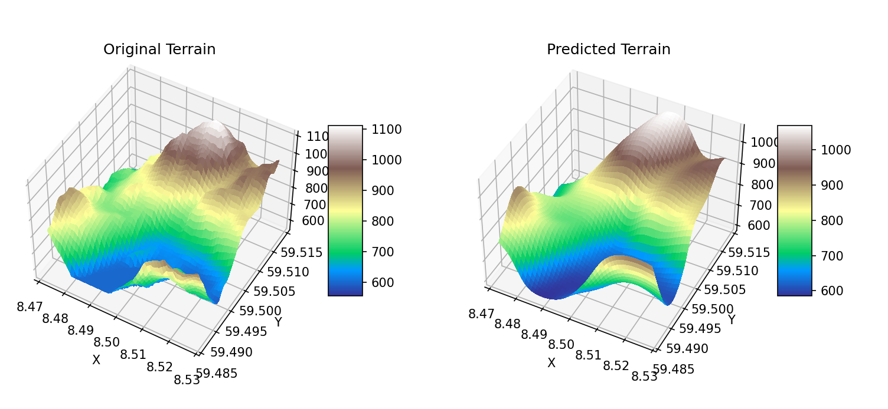

# Project 2 - FYS-STK4155

You can explore the results from the project by exploring the [notebooks](ml-p2/notebooks). The notebooks are named according to the tasks they are solving from the [project description](../README.md#project-description).



## Getting Started

This project is managed by poetry and uses the `pyproject.toml` file to manage dependencies. 

If you dont have poetry installed, you can install this as package using pip into a conda environment. 

1. create a new conda environment
```bash
conda create -n p2 python=^3.12
``` 

2. Activate the environment
```bash
conda activate p2
```

3. Install the package
```bash
pip install git+https://github.com/javidaf/expert-machine.git@master#subdirectory=ml-p2
```
----------------
### Basic usage
Run tests modules

**Make sure you have activated the conda environment you installed the package in**

1. Regression with NN
```python
python -m ml_p2.tests.test_nn_regression
```

2. Classification with NN
```python  
python -m ml_p2.tests.test_nn_classification
```

3. Logistic Regression
```python
python -m ml_p2.tests.test_logit
```

4. 
----------------


### Codebase Description

The codebase for this project is organized into several main components:

- **neural_network**: Contains the implementation of the Feed Forward Neural Network (FFNN) and related utilities.
    - `ffnn.py`: Defines the `NeuralNetwork` class and its methods.
    - `model_comparison.py`: Provides functionality to compare different models on the same dataset.

- **regression**: Contains the implementation of logistic regression and related utilities.
    - `logistic_regression.py`: Defines the `LogisticRegression` class and its methods, including grid search for hyperparameter tuning.

- **tests**: Contains test scripts for validating the neural network and logistic regression implementations.
    - `test_nn_classification.py`: Tests the neural network on a classification task.
    - `test_nn_regression.py`: Tests the neural network on a regression task.
    - `test_logit.py`: Tests the logistic regression implementation.

- **notebooks**: Contains Jupyter notebooks for exploring and visualizing the results of the project.
    - `NN.ipynb`: Notebook for neural network experiments.
    - `logit.ipynb`: Notebook for logistic regression experiments.

- **utils**: Contains utility functions for data generation, preprocessing.

- **data**: Contains datasets used in the project.

- **visualization**: Contains utility functions for visualizing the results of the project.

Each component is designed to be modular and reusable, allowing for easy experimentation and comparison of different machine learning models.

